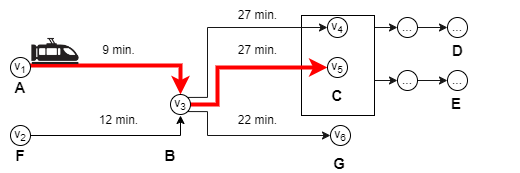

<!-- ## Abstract -->

This paper proposes an iterative Maximum Satisfiability (MaxSAT) approach designed to solve train scheduling optimization problems. The generation of railway timetables is known to be intractable for a single track. We consider hundreds of trains on interconnected multi-track railway networks with complex connections between trains. Furthermore, the proposed algorithm is incremental to reduce the impact of time discretization.

The performance of our approach is evaluated with the real-world Swiss Federal Railway (SBB) Crowd Sourcing Challenge benchmark and Periodic Event Scheduling Problems benchmark (PESPLib). The execution time of the proposed approach is shown to be, on average, twice as fast as the best existing solution for the SBB instances. In addition, we achieve a significant improvement over SAT-based solutions for solving the PESPLib instances.

We also analyzed real schedule data from Switzerland and the Netherlands to create a disruption generator based on probability distributions. The novel incremental algorithm allows solving the train scheduling problem under disruptions with better performance than traditional algorithms.

## Info

*DOI:* https://doi.org/10.1613/jair.1.14924

*Published:* Mar 31, 2024

*Keywords:* constraint satisfaction, logic programming, Boolean satisfiability, scheduling

